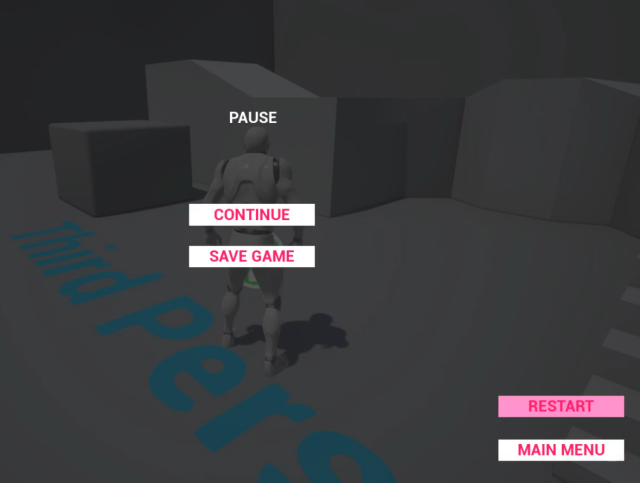

# BPMenuDemo
Menu example for Unreal Engine 4 (Blueprints).

Tested on UE 4.25.3.

## Strcucture:
* UI logic (UMG_Menu*) is separated from Game logic (CtrlActor_Menu*)
* customizable Menu (inherited from UMG_Menu_Base and CtrlActor_Menu_Base)
* customizable Menu Items (inherited from UMG_MenuItem_Base)

## Navigation:
* by keyboard
* by mouse
* by gamepad
* by touch

Navigation keys are not hardcoded and defined in Project's settings.

## How to:
* Menu UI
  * inherit UI of own menu from ```UMG_Menu_Base``` and ```UMG_MenuItem_Base```
  * place menu items to the new custom menu
  * bind handler to event ```OnMenuItemSelected_UMG``` to process item selection inside the UMG class
* Game Logic
  * inherit Logic of own menu from CtrlActor_Menu_Base
  * set property ```Level Menu Type``` to your own UMG_Menu* class
  * bind handler to event ```OnMenuItemSelected_Actor``` to process item selection inside the Actor class
* Place your own new ```CtrlActor_Menu*``` to the level/map
* profit

## Youtube:

[](https://youtu.be/e_xSTdhiyjc)
